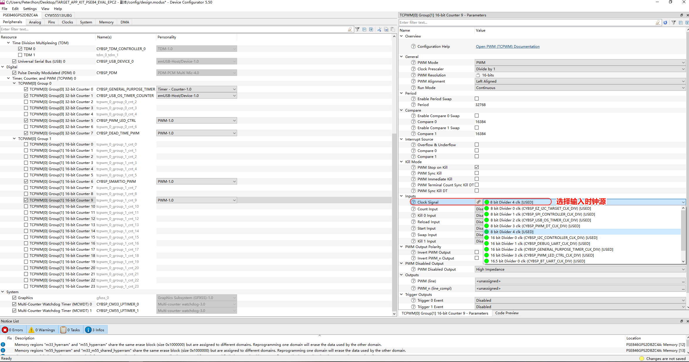
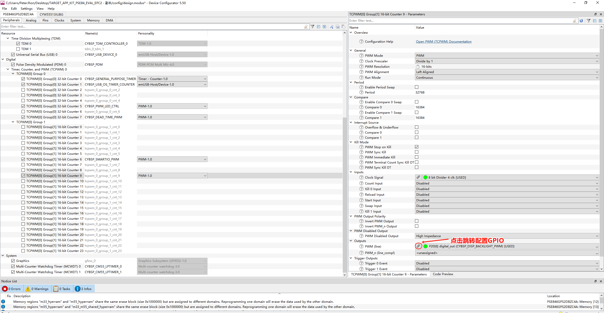
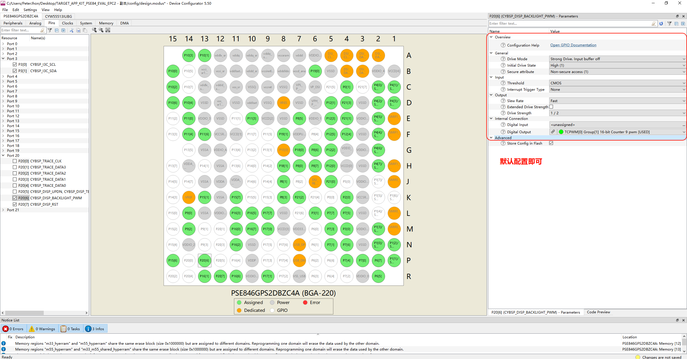

# PWM Device Configurator 配置指南

## 打开配置文件

请使用以下工具打开配置文件：

```bash
tools/device-configurator/device-configurator.exe
libs/TARGET_APP_KIT_PSE84_EVAL_EPC2/config/design.modus
```

---

## 1. 配置 TCPWM 为 PWM 模式


---

## 2. 选择输入时钟源



---

## 3. 设置 PWM 输出引脚


---

## 4. 设置输入引脚模式





---

## 保存配置

完成全部配置后，按 **`Ctrl + S`** 保存即可。

